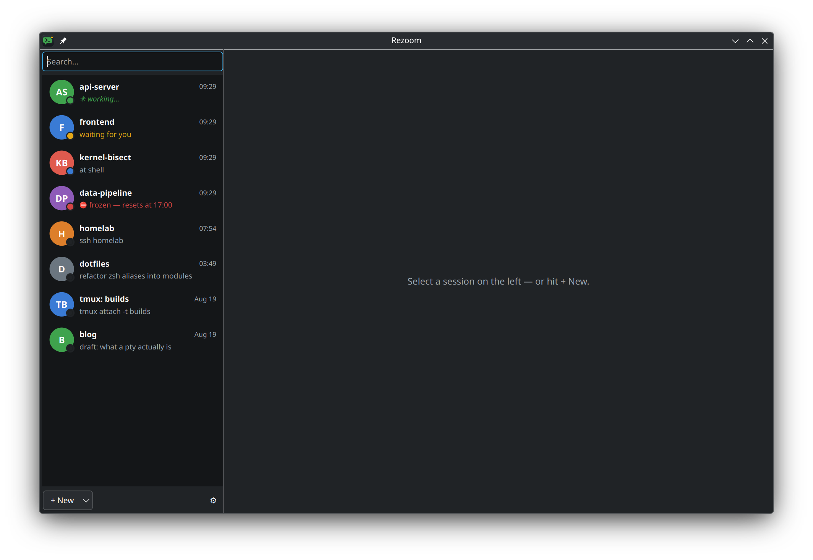

# Rezoom

**WhatsApp for your Claude Code sessions and terminals.** Native C++/Qt6, KDE-native
dark/light theming, embedded Konsole terminals. Every session — claude, shell, ssh,
tmux — is a chat in the left panel and stays **forever resumable**.



[](https://github.com/BEX-Robotics/rezoom/releases)
[](LICENSE)

## What it does

- **Live presence** — watches the registry Claude Code itself maintains
  (`~/.claude/sessions/`): green = working, amber = waiting for you, blue = shell,
  red = frozen on a usage limit, hollow = resumable. Finished-while-unfocused chats
  get an unread marker.
- **Auto-adopt** — every new interactive claude session on the machine becomes a
  chat by itself; background agent sessions are filtered out.
- **Auto-resume** — the sessions that were running come back on startup (survives
  crashes: the running set is persisted continuously, not on quit).
- **Automatic session tracking** — session ids recorded live (including id changes
  after `/clear`), plus ssh/tmux commands typed into embedded terminals remembered
  as "how to get back in".
- **Resume anything** — dead chats show the exact resumable command behind one
  button. Command templates are configurable per chat and globally
  (`~/.config/rezoom/rezoom.conf`).
- **Adopt everything** — running claudes, any historical transcript, tmux sessions,
  live ssh clients. External sessions are never touched: raise their window, or
  **pull them in live** via reptyr (verified, with automatic fallback to lossless
  kill-and-resume).
- **Floating groups** — pop chats into floating tab windows (one per screen), pull
  them back; the whole layout persists across restarts.
- **Freeze detection** — a Notification hook feeds limit/credit banners into the
  app; frozen sessions turn red with the reset time.
- **Consent-first SSH** — ssh chats never connect on their own; the button press is
  the consent. Optional remote scan finds claude/tmux sessions on hosts you use.
- **Single instance** — relaunching raises the window; `rezoom --resume <query>`
  acts on the running instance (KRunner-friendly).

## Install

**Debian/Ubuntu** — grab the `.deb` from the
[latest release](https://github.com/BEX-Robotics/rezoom/releases/latest):

```sh
sudo apt install ./rezoom_1.0.0_amd64.deb   # pulls Qt6/KF6/konsole-kpart via apt
```

**Fedora/openSUSE** — build from the spec: `rpmbuild -ba dist/rezoom.spec`
(or point Copr/OBS at it).

**Arch** — `dist/PKGBUILD` is AUR-ready: `makepkg -si` from a directory containing it.

All packaging depends on distro packages — nothing bundled, nothing statically
linked. Flatpak/AppImage are deliberately absent: Rezoom leans on the host's
Konsole/KF6. Without KDE's `konsole-kpart` (e.g. macOS) it builds and runs with
external terminal windows instead of embedded panes.

Optional extras: `reptyr` for live pull-in
(`sudo setcap cap_sys_ptrace+ep $(which reptyr)` to allow it under Yama),
`tmux` for persistent plain terminals.

## Build from source

```sh
sudo apt install qt6-base-dev libkf6parts-dev libkf6service-dev \
                 libkf6coreaddons-dev libkf6i18n-dev extra-cmake-modules
cmake -B build -G Ninja
ninja -C build
build/rezoom
```

## CLI

```sh
rezoom-cli list                  # chats + live presence (TSV)
rezoom-cli resume <query>        # reopen a chat in a terminal window
rezoom-cli resume <query> --print
rezoom-cli adopt-running         # adopt every untracked running claude
rezoom --resume <query>          # GUI: select + launch (forwards to a running instance)
```

## Files

| Path | What |
|---|---|
| `~/.local/share/rezoom/sessions.json` | chat records (multi-process safe) |
| `~/.local/share/rezoom/notifications.jsonl` | Notification-hook capture |
| `~/.config/rezoom/rezoom.conf` | templates, prefs, UI layout |
| `~/.claude/sessions/<pid>.json` | live registry (written by claude, read-only) |
| `~/.claude/projects/*/<uuid>.jsonl` | transcripts (read-only) |

`$REZOOM_DATA_DIR` and `$REZOOM_CLAUDE_DIR` override the store and registry
locations (tests, demos).

## License

MIT.
