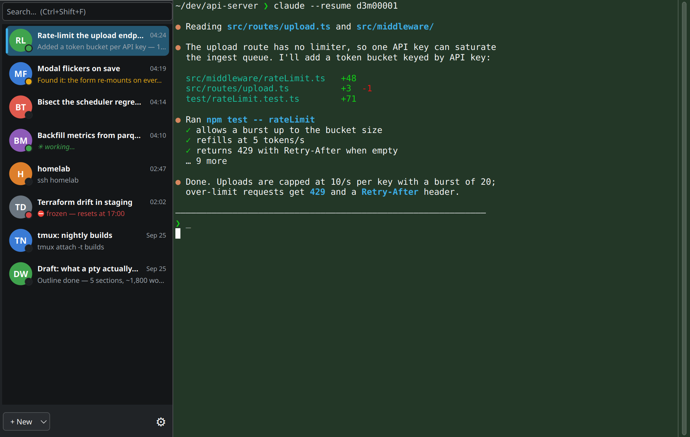
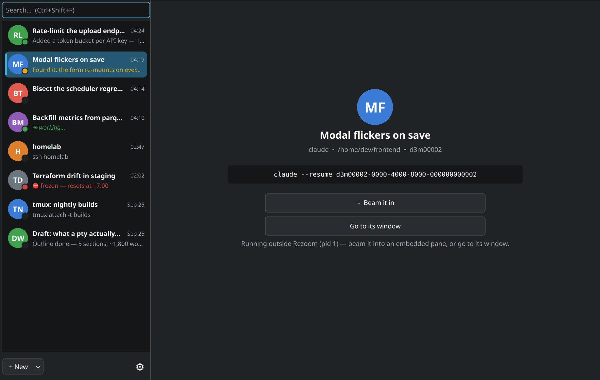

# Rezoom

**One chat list for every AI coding session on your machine.** Rezoom shows each
agent, ssh, tmux or shell session as a chat: what it's doing right now, what it last
said, and one click to bring it back. Native C++/Qt6, follows your KDE light/dark
theme, embeds real Konsole terminals.

| Agent | What Rezoom knows |
|---|---|
| **Claude Code** | live state (working, waiting, frozen), live title and output, auto-adopt, freeze detection |
| **Codex** | found in history, adopted, resumed with `codex resume`, detected when started in a pane |
| **Any other CLI agent** (aider, Gemini CLI, opencode…) | runs as a terminal chat; resumable through a command template in Settings |
| **Agents on other machines, over SSH** | the ssh you typed is remembered as the way back in; **Scan remote** finds claude and tmux sessions on a host and adopts each as a chat that resumes over ssh |

[](https://github.com/BEX-Robotics/rezoom/actions/workflows/ci.yml)
[](https://github.com/BEX-Robotics/rezoom/releases)
[](LICENSE)



## What it does

- **See everything at once.** Rezoom reads the registry Claude Code already writes
  (`~/.claude/sessions/`). Every session shows a presence dot — green working,
  amber finished and waiting for you, grey idle, blue at a shell, red frozen on a usage limit, hollow
  resumable — its live title, and its latest output while it works. New sessions
  appear on their own; tool-spawned ones (in `/tmp`, or started by another claude)
  are left out.
- **Find the one you mean.** External sessions carry their Konsole window title,
  and search matches titles, messages and folders.
- **Never lose a session.** Every chat keeps the exact command that brings it back.
  Whatever was running comes back when Rezoom starts, even after a crash.
- **Move sessions without killing them.** A session running in some other Konsole
  window can be beamed into Rezoom live (reptyr), or you can jump to its window.
  "Restart to update" is one keystroke per session.
- **Rezoom over SSH.** An `ssh` typed in any pane is recorded as that chat's way back
  in; live ssh connections can be adopted; **Scan remote** lists the claude and tmux
  sessions on a host and adopts each one, resuming with `ssh -t host 'claude --resume …'`.
  Nothing connects until you click.
- **More than one Claude login? Optional.** Right-click a chat → **Run under another
  Claude account…** (`Ctrl+Shift+K`) creates a separate account (`~/.claude-<name>`,
  optionally sharing your settings and CLAUDE.md), and you `/login` inside claude once.
  Those chats carry a small account tag and always resume under their account.
  With a single login, none of this appears.
- **Group across screens.** Float chats into their own tabbed windows and pull them
  back; the layout survives restarts.
- **Know when something's wrong.** A session frozen by Ctrl+Z shows as *suspended*
  (the kernel says so; claude's own status can't) with **▶ Continue** in its own
  terminal or *Resume in Rezoom instead*; a "busy" session whose transcript hasn't
  moved for two hours shows *no progress*; an ssh that ends inside a Rezoom pane
  gets a bar with **Reconnect** (a click, never automatic).
- **Know when you're blocked.** One click in Settings installs a Claude Code
  Notification hook; sessions frozen on a usage limit turn red with the reset time.
- **Keyboard first.** Everything has a `Ctrl+Shift` chord (`Ctrl+Shift+/` lists them),
  so plain Ctrl keys still reach your shell.



## Privacy

Rezoom runs entirely on your machine and never calls an API. It reads Claude's own
files and writes only its own. The two exceptions are opt-in and say so in Settings:
the freeze-detection hook (added to `~/.claude/settings.json`, with a backup) and
skipping Claude's "trust this folder?" prompt for folders you already use (off by
default). SSH chats never connect until you click.

## Install

**Debian/Ubuntu (25.04 or newer, for KF6)** — download the `.deb` from the
[latest release](https://github.com/BEX-Robotics/rezoom/releases/latest):

```sh
sudo apt install ./rezoom_1.1.0_amd64.deb   # pulls Qt6/KF6/konsole-kpart via apt
```

**Fedora/openSUSE** — build from the spec: `rpmbuild -ba dist/rezoom.spec`.

**Arch** — `dist/PKGBUILD`: `makepkg -si` from a directory containing it.

Packages depend on your distro's Qt/KF6; nothing is bundled.

Optional: `reptyr` for moving live sessions
(`sudo setcap cap_sys_ptrace+ep $(which reptyr)` to allow it under Yama — Settings
shows whether it's ready), `tmux`, `jq` for the freeze-detection hook.

## Build from source

Linux:

```sh
sudo apt install qt6-base-dev libkf6parts-dev libkf6service-dev \
                 libkf6coreaddons-dev libkf6i18n-dev extra-cmake-modules
cmake -B build -G Ninja
ninja -C build
build/rezoom
```

macOS:

```sh
brew install cmake ninja qt
cmake -B build -G Ninja -DCMAKE_PREFIX_PATH="$(brew --prefix qt)"
ninja -C build
build/rezoom
```

### On macOS

KF6/Konsole is KDE-only, so chats open in Terminal.app windows instead of embedded
panes. Presence, titles, search, auto-adopt, auto-resume, restart, archive, templates
and freeze detection work the same: Claude Code writes the same registry on macOS.
Beam-in and "Go to its window" need Linux (reptyr, KWin) and don't appear on macOS,
and single-instance is off there (the session store stays consistent anyway).

## CLI

```sh
rezoom-cli list                  # chats + live presence (TSV)
rezoom-cli resume <query>        # reopen a chat in a terminal window
rezoom-cli resume <query> --print
rezoom-cli adopt-running         # adopt every untracked running claude
rezoom-cli prune                 # drop dead chats stranded in /tmp
rezoom --resume <query>          # GUI: select + launch (forwards to a running instance)
```

## Files

| Path | What |
|---|---|
| `~/.local/share/rezoom/sessions.json` | chat records (multi-process safe) |
| `~/.local/share/rezoom/notifications.jsonl` | freeze-detection capture |
| `~/.config/rezoom/rezoom.conf` | templates, preferences, window layout |
| `~/.claude/sessions/<pid>.json` | live registry (written by claude, read-only) |
| `~/.claude/projects/*/<uuid>.jsonl` | transcripts (read-only) |

`$REZOOM_DATA_DIR` and `$REZOOM_CLAUDE_DIR` point the app at other locations, and
`$REZOOM_SCREENSHOT=<file.png>` renders the window to a PNG and quits — that's how
the screenshots above were made, from demo data.

## License

MIT.
